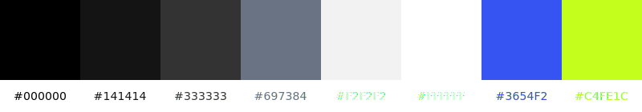

# Blog


Source for colors: [SONY Pix Logo](https://www.sonypicturesnetworks.com/news-details/0/369/sony-pix-promises-another-year-of-lsquo-stay-amazed-rsquo)

Font: [Bricolage Grotesque](https://fonts.google.com/specimen/Bricolage+Grotesque)

## Development

```bash
hugo server --bind "0.0.0.0" -p PORT --baseURL "http://YOUR_LOCAL_IP:PORT/"

# hugo server --bind "0.0.0.0" -p 1234 --baseURL "http://10.0.0.20:1234/"
```

> [!NOTE]
>
> important to set the `--baseURL` manually to override the one set in `hugo.toml`
